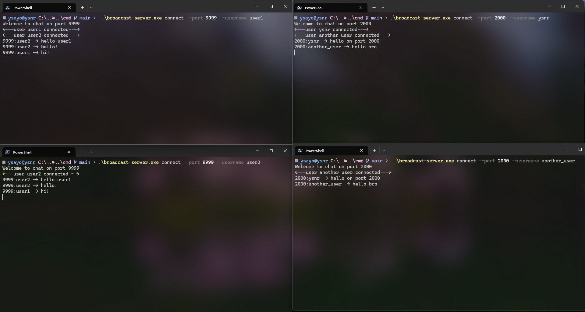
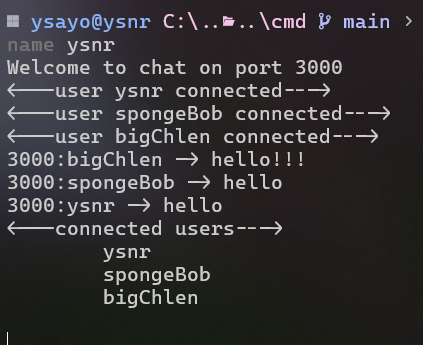

# Broadcast server

Pure broadcast server that allows users to communicate on various ports


### Language and frameworks

- Golang
- gorilla/mux
- gorilla/websocket

### Instalation

1. Clone repository on your dekstop:

```bash
git clone https://github.com/ysayonnar/broadcast-server.git
```

2. Install Golang
3. Get dependecies

```bash
go get -u github.com/gorilla/websocket
go get -u github.com/gorilla/mux
```

4. Build

```bash
cd cmd
go build -o broadcast-server main.go
```

### Usage

1. Start server

```bash
broadcast-server start
```

2. Create various connections

```bash
broadcast-server connect --port <port> --username <username>
```

#### Hint

 Use `broadcast-server help` for more info

 Type `--users` in chat to see connected users
  
